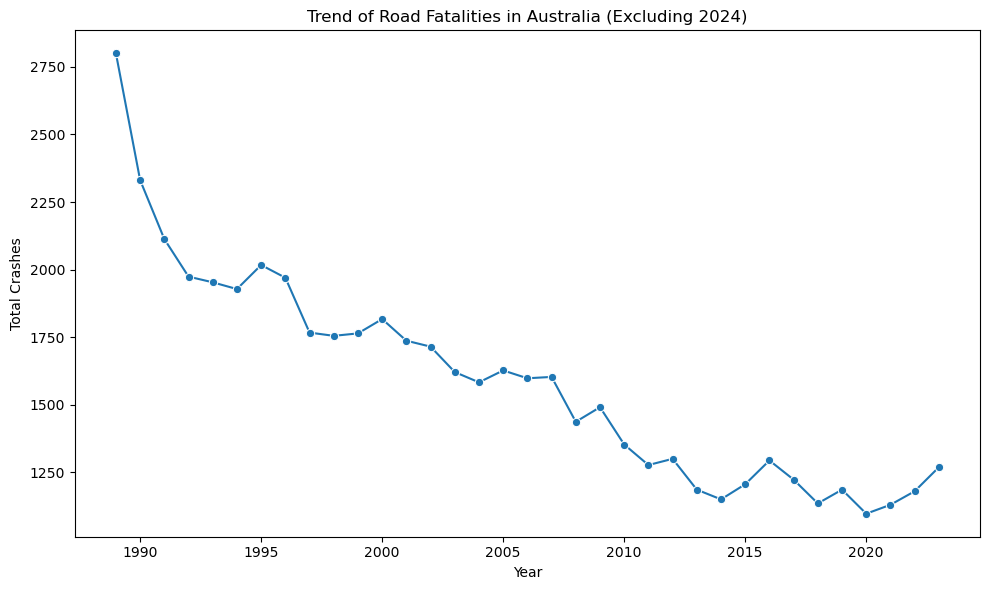
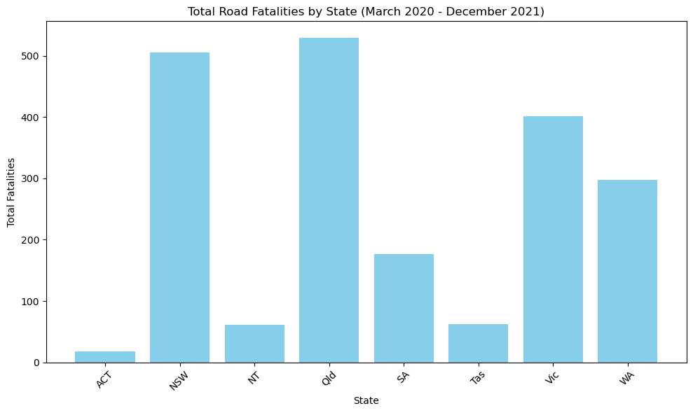
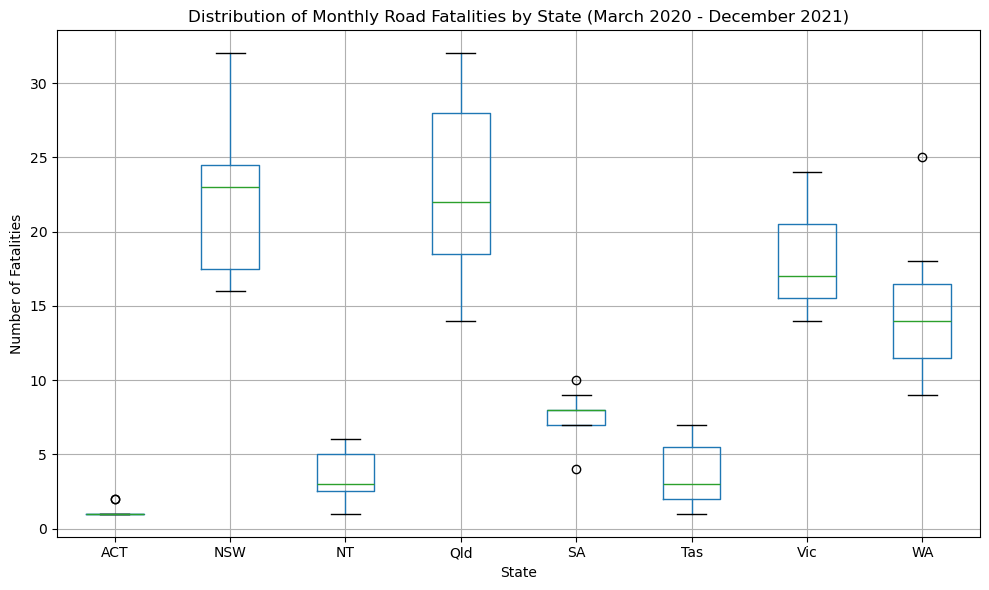

<h1 align = "center"> Australia Road Fatality </h1>

Fatal crashes: each record is a fatal crash. Details include year, month, day of week, time, location, crash type, and involvement of particular vehicle types.

## Table of Contents

- [Data](#data)
- [Libraries Used](#libraries-used)
- [Results](#results)
- [References](#references)
- [License](#license)

## Data

| Column                        | Description                                                                                                                                                                              |
| ----------------------------- | ---------------------------------------------------------------------------------------------------------------------------------------------------------------------------------------- |
| Crash ID                      | A unique identifier for each crash in the dataset. It helps distinguish between different crashes.                                                                                       |
| State                         | The state or territory where the crash occurred (e.g., NSW, QLD). This helps geographically categorise crashes.                                                                          |
| Month                         | The month in which the crash occurred, represented numerically (1 for January, 2 for February, etc.).                                                                                    |
| Year                          | The year the crash occurred. It allows for time-based analysis and trend identification over years.                                                                                      |
| Dayweek                       | The day of the week when the crash occurred (e.g., Monday, Friday). This is useful for analysing patterns related to specific days.                                                      |
| Time                          | The time of day the crash occurred, typically in 24-hour format (e.g., 14:00 for 2 PM). It helps assess whether crashes are more likely at specific times.                               |
| Bus Involvement               | Indicates whether a bus was involved in the crash (Yes/No). This is useful for understanding the involvement of public transport.                                                        |
| Heavy Rigid Truck Involvement | Indicates whether a heavy rigid truck (a large truck) was involved in the crash (Yes/No).                                                                                                |
| Articulated Truck Involvement | Indicates whether an articulated truck (like a semi-trailer or long-haul truck) was involved (Yes/No).                                                                                   |
| Speed Limit                   | The speed limit (in km/h) of the road where the crash occurred. This can help determine if speed limits were a factor in crashes.                                                        |
| Road User                     | Describes the type of road user involved in the crash (e.g., pedestrian, driver, motorcyclist). This helps classify the type of participants in the crash.                               |
| Gender                        | The gender of the person involved in the fatality (Male/Female). This is useful for demographic analysis of fatalities.                                                                  |
| Age                           | The age of the person involved in the crash. It provides further demographic insights into the people involved in fatal crashes.                                                         |
| National Remoteness Areas     | Classifies the location of the crash based on the remoteness of the area (e.g., Major Cities, Inner Regional, Outer Regional, etc.). This helps analyse urban vs. rural crashes.         |
| SA4 Name 2021                 | Statistical Area Level 4, a geographic region based on the 2021 census, representing large regions in Australia. This gives detailed geographic information.                             |
| National LGA Name 2021        | Local Government Area name based on 2021 census data. This provides a finer geographic classification.                                                                                   |
| National Road Type            | The classification of the road type where the crash occurred (e.g., Arterial Road, Collector Road, Sub-arterial Road). It helps to understand the infrastructure where crashes occurred. |
| Christmas Period              | Indicates whether the crash occurred during the Christmas holiday period (Yes/No). Useful for analysing seasonal effects on crashes.                                                     |
| Easter Period                 | Indicates whether the crash occurred during the Easter holiday period (Yes/No).                                                                                                          |
| Age Group                     | Groups the ages of the individuals involved into categories (e.g., 18 to 25, 40 to 64). This is helpful for broader demographic analysis.                                                |
| Day of week                   | Indicates whether the crash occurred on a weekday or weekend. This categorisation helps in analysing crash patterns across workdays and weekends.                                        |
| Time of day                   | Groups the crash time into broad categories like "Day" or "Night" to identify time-based patterns in fatalities.                                                                         |

## Libraries Used

- pandas
- numpy
- matplotlib
- scipy.stats

## Results

<b> Q1: What is the general trend for road fatalities in Australia over the past 35 years? </b>

The graph shows the trend of total road crashes in Australia from 1989 to 2023, with a clear overall downward trend in the number of crashes. Below is a detailed summary and analysis based on the visualisation:

1. Significant Decrease in Road Crashes Over Time:

- In 1989, there were approximately 2800 crashes per year.
- By 2023, this number has decreased to about 1269 crashes, representing a reduction of over 50% in road crashes during the 35-year period.
- The most substantial reduction occurred between 1989 and 1992, where crashes dropped from 2800 to 1974.

2. Fluctuations in Decline:

- The overall trend is downward, but there are periods of stability and slight increases:
  - After the sharp decline between 1989 and 1992, crashes stabilised around 1900-2000 crashes per year between 1992 and 1997.
  - From 1998 to 2010, there was a continued decrease in crashes, with numbers dropping from 1755 in 1998 to a low of 1277 in 2011.
  - Post-2011, crashes continued to decline, reaching a low of 1097 crashes in 2020.
- After 2020, there was a slight uptick in crashes, rising to 1269 in 2023.

3. Implications of the Decline:

- The consistent reduction in road crashes can likely be attributed to several factors:
  - Improved road safety measures: Better road infrastructure, stricter traffic law enforcement, and increased awareness of road safety likely contributed to this reduction.
  - Technological Advances: The development of safer vehicle technologies (such as airbags, anti-lock braking systems, and electronic stability control) likely played a significant role.
  - Government intervention: Policies such as lower speed limits, mandatory seatbelt usage, and zero-tolerance for drink-driving helped reduce crashes.

4. Recent Stability and Slight Uptick:

- In the years between 2020 and 2023, there was a slight rise in the number of crashes, increasing from 1097 crashes in 2020 to 1269 in 2023.
- This recent increase could be due to the rebound effect post-pandemic, as more vehicles returned to the road following COVID-19 restrictions. It may also be driven by new factors such as distractions from mobile devices or other technological impacts.

Summary

- The data show that road safety in Australia has significantly improved over the last 30 years, with crashes decreasing by over 50%, from 2800 in 1989 to 1269 in 2023.
- While much of this reduction can be attributed to advancements in safety technology, better driver education, and stronger laws, the slight rise in recent years warrants further investigation.

Statistical Insights

- Time Series Analysis: The long-term downward trend suggests that safety measures have had a substantial positive impact in reducing crashes.
- Comparison: Comparing the peak crash periods of the early 1990s with the most recent years highlights a dramatic improvement in road safety.
- Correlation: Further analysis could explore the relationship between crash trends and external factors, such as changes in vehicle technology, traffic enforcement policies, or driver behaviour over the years.

 

<b> Q2: Anova test: Did the variance in monthly road fatalities differ significantly between Australian states during the COVID-19 lockdown period (March 2020 to December 2021)? </b>

<u> Bar Plot: Total Fatalities Across States </u>

The bar plot below provides a comparison of the total number of road fatalities across Australian states during the COVID-19 lockdown period (March 2020 to December 2021).

 

The bar plot shows a single cumulative value for each state, summing up all fatalities over the lockdown period. It is clear that larger states, such as New South Wales (NSW) and Queensland (QLD), recorded the highest total fatalities. In contrast, smaller states like Australian Capital Territory (ACT) and Northern Territory (NT) had significantly fewer overall fatalities.

While this plot offers an easy comparison of total fatalities across states, it doesn't provide insight into the month-to-month variability in fatalities or whether certain states experienced more volatility.

 

<u> Box Plot: Monthly Fatality Distribution per State </u>

To explore how fatalities varied over time, the box plot below highlights the distribution of monthly road fatalities for each state, revealing variability, outliers, and the spread in the data.

 

The box plot provides deeper insights into how fatalities fluctuated month-to-month in each state. For example:

NSW had relatively consistent monthly fatalities, with fewer extreme outliers.
Queensland, however, showed more significant variability, with certain months experiencing notably higher fatalities (indicated by a larger interquartile range and outliers).
Smaller states like NT also showed higher fluctuations despite lower overall fatalities, suggesting certain months of heightened road risk.
These differences indicate that road fatalities didn’t remain constant across the lockdown period and varied based on state-specific factors like population behavior, lockdown measures, and regional road safety conditions.

 

<u> ANOVA Test: Comparison of Variance in Fatalities Across States </u>

To statistically test whether the variance in monthly road fatalities differed significantly between states, an ANOVA test was conducted.

- Null Hypothesis (H0): There is no significant difference in the variance of monthly road fatalities between the Australian states.
  - Mathematically, 𝐻0: 𝜎_1{^2}=𝜎_2{^2}=⋯=𝜎_𝑘^{2}, where 𝜎_1^{2},𝜎_2^{2},…,𝜎_𝑘^{2} are the variances in monthly road fatalities for each of the states.
- Alternative Hypothesis (H1): At least one state's variance in monthly road fatalities is significantly different from the others.
  - Mathematically, 𝐻1: 𝜎_𝑖^{2}≠𝜎_𝑗^{2} for at least one pair of states.
  
 

Since the p-value is much lower than 0.05, we reject the null hypothesis. This means that the variance in monthly road fatalities did, in fact, differ significantly between the Australian states during the COVID-19 lockdown period. The large F-statistic suggests that the variance between groups (states) is much higher than the variance within groups (month-to-month fatalities within each state).

<u>Implications</u>

The ANOVA test provides strong evidence that the variance in monthly road fatalities was not uniform across states. States such as Queensland and NT exhibited more volatility in monthly fatalities, while others, like NSW, had more consistent figures over the lockdown period.

This variance could be attributed to several factors:

- Lockdown measures: Different states implemented varying degrees of travel restrictions and lockdowns, which may have impacted road usage and safety.
- Regional behaviours: States with more rural or open-road driving may have seen spikes in fatalities as restrictions fluctuated or relaxed.
- Population density: Larger states like NSW, despite having a higher total, may have had fewer spikes due to stricter enforcement or more regular traffic patterns.

 

<u> Conclusion</u>

In conclusion, the results of the ANOVA test and visualizations underscore the importance of state-specific road safety measures during periods of restricted movement, such as lockdowns. The significant differences in variance highlight the need for targeted interventions in states that experienced more variability and volatility in road fatalities. Policymakers should investigate further into the factors contributing to these differences to better prepare for future crises and enhance road safety measures during emergency situations.

The bar plot showed the cumulative fatality totals, while the box plot revealed the monthly variability within each state. The ANOVA test statistically confirmed that these variances were significant, providing valuable insights for future safety strategies.

 

<b> Q3: In the past four years, is there a noticeable trend in the number of road fatalities based on various factors such as speed limits, age, time of day, day of the week, and type of road? </b>

 

<b> Q4: Specifically in Victoria, did the introduction of booze buses and mobile speed radars have a significant impact on road fatalities? </b>

 

<b> Q5: In 1999, Victoria rewrote various road regulations. Did this change have a significant impact on road fatalities? How did this compare to NSW across the same period? </b>

## References

https://www.bitre.gov.au/statistics/safety/fatal_road_crash_database

## License

This project is licensed under the [MIT License](https://github.com/Yukitoshi12345/Australia-Road-Fatality/blob/main/LICENSE).
