<h1 align = "center"> Australia Road Fatality </h1>

Fatal crashes: each record is a fatal crash. Details include year, month, day of week, time, location, crash type, and involvement of particular vehicle types.

## Table of Contents

- [Data](#data)
- [Libraries Used](#libraries-used)
- [Results](#results)
- [References](#references)
- [License](#license)

## Data

This project utilises an Excel dataset to analyze road fatalities in Australia, using historical crash data sourced from the Australian Bureau of Infrastructure and Transport Research Economics (BITRE). The dataset, available through the Fatal Road Crash Database (https://www.bitre.gov.au/statistics/safety/fatal_road_crash_database), provides detailed information on fatal road accidents across the country. By examining various factors, this project applies data analysis techniques to uncover critical trends and patterns. These insights are aimed at supporting road safety strategies and identifying areas for targeted intervention to reduce fatalities.

| Column                        | Description                                                                                                                                                                              |
| ----------------------------- | ---------------------------------------------------------------------------------------------------------------------------------------------------------------------------------------- |
| Crash ID                      | A unique identifier for each crash in the dataset. It helps distinguish between different crashes.                                                                                       |
| State                         | The state or territory where the crash occurred (e.g., NSW, QLD). This helps geographically categorise crashes.                                                                          |
| Month                         | The month in which the crash occurred, represented numerically (1 for January, 2 for February, etc.).                                                                                    |
| Year                          | The year the crash occurred. It allows for time-based analysis and trend identification over years.                                                                                      |
| Dayweek                       | The day of the week when the crash occurred (e.g., Monday, Friday). This is useful for analysing patterns related to specific days.                                                      |
| Time                          | The time of day the crash occurred, typically in 24-hour format (e.g., 14:00 for 2 PM). It helps assess whether crashes are more likely at specific times.                               |
| Bus Involvement               | Indicates whether a bus was involved in the crash (Yes/No). This is useful for understanding the involvement of public transport.                                                        |
| Heavy Rigid Truck Involvement | Indicates whether a heavy rigid truck (a large truck) was involved in the crash (Yes/No).                                                                                                |
| Articulated Truck Involvement | Indicates whether an articulated truck (like a semi-trailer or long-haul truck) was involved (Yes/No).                                                                                   |
| Speed Limit                   | The speed limit (in km/h) of the road where the crash occurred. This can help determine if speed limits were a factor in crashes.                                                        |
| Road User                     | Describes the type of road user involved in the crash (e.g., pedestrian, driver, motorcyclist). This helps classify the type of participants in the crash.                               |
| Gender                        | The gender of the person involved in the fatality (Male/Female). This is useful for demographic analysis of fatalities.                                                                  |
| Age                           | The age of the person involved in the crash. It provides further demographic insights into the people involved in fatal crashes.                                                         |
| National Remoteness Areas     | Classifies the location of the crash based on the remoteness of the area (e.g., Major Cities, Inner Regional, Outer Regional, etc.). This helps analyse urban vs. rural crashes.         |
| SA4 Name 2021                 | Statistical Area Level 4, a geographic region based on the 2021 census, representing large regions in Australia. This gives detailed geographic information.                             |
| National LGA Name 2021        | Local Government Area name based on 2021 census data. This provides a finer geographic classification.                                                                                   |
| National Road Type            | The classification of the road type where the crash occurred (e.g., Arterial Road, Collector Road, Sub-arterial Road). It helps to understand the infrastructure where crashes occurred. |
| Christmas Period              | Indicates whether the crash occurred during the Christmas holiday period (Yes/No). Useful for analysing seasonal effects on crashes.                                                     |
| Easter Period                 | Indicates whether the crash occurred during the Easter holiday period (Yes/No).                                                                                                          |
| Age Group                     | Groups the ages of the individuals involved into categories (e.g., 18 to 25, 40 to 64). This is helpful for broader demographic analysis.                                                |
| Day of week                   | Indicates whether the crash occurred on a weekday or weekend. This categorisation helps in analysing crash patterns across workdays and weekends.                                        |
| Time of day                   | Groups the crash time into broad categories like "Day" or "Night" to identify time-based patterns in fatalities.                                                                         |

## Libraries Used

- pandas
- numpy
- matplotlib
- scipy.stats

## Results

<b> Q1: What is the general trend for fatal crashes in Australia over the past 35 years? </b>

Scope: Fatal crashes, 1989–2023 (2024 excluded).

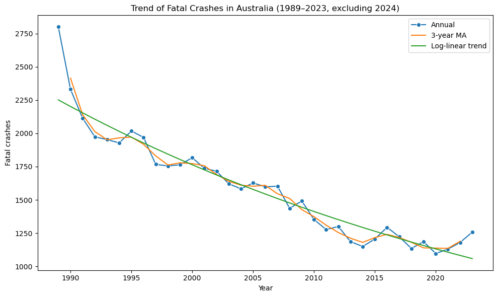

The graph shows the trend of total fatal crashes in Australia from 1989 to 2023 (excluding 2024). The analysis also includes a smoothed 3‑year moving average and a log‑linear fitted trend, which both reinforce the clear long‑run decline.

Headline metrics:

- Relative decline (1989→2023): ~55.1%
- CAGR (annualised): ~−2.33% per year
- Log‑linear trend slope and p‑value are printed in the notebook output (Q1 cell) alongside the chart.

Below is a detailed summary and analysis based on the visualisation:

1. Significant Decrease in Fatal Crashes Over Time:

- In 1989, there were approximately 2800 fatal crashes per year.
- By 2023, this number has decreased to about 1269 fatal crashes, representing a reduction of over 50% during the 35-year period.
- The most substantial reduction occurred between 1989 and 1992.

2. Fluctuations in the Decline:

- The overall trend is downward, but there are periods of stability and slight increases:
  - After the sharp decline between 1989 and 1992, totals stabilised around 1900–2000 fatal crashes per year between 1992 and 1997.
  - From 1998 to 2010, there was a continued decrease, with a local low around 2011.
  - Post-2011, totals continued to decline, reaching a low in 2020.
- After 2020, there was a slight uptick, rising into 2023.

3. Implications of the Decline:

- The consistent reduction in fatal crashes can likely be attributed to several factors:
  - Improved road safety measures: Better road infrastructure, stricter traffic law enforcement, and increased awareness of road safety likely contributed to this reduction.
  - Technological Advances: The development of safer vehicle technologies (such as airbags, anti-lock braking systems, and electronic stability control) likely played a significant role.
  - Government intervention: Policies such as lower speed limits, mandatory seatbelt usage, and zero-tolerance for drink-driving helped reduce fatal crashes.

4. Recent Stability and Slight Uptick:

- In the years between 2020 and 2023, there was a slight rise in the number of fatal crashes.
- This recent increase could be due to the rebound effect post-pandemic, as more vehicles returned to the road following COVID-19 restrictions. It may also be driven by new factors such as distractions from mobile devices or other technological impacts.

Summary

- The data show that road safety in Australia has significantly improved over the last 30 years, with fatal crashes decreasing by over 50% from 1989 to 2023.
- While much of this reduction can be attributed to advancements in safety technology, better driver education, and stronger laws, the slight rise in recent years warrants further investigation.

Statistical Insights

- Time Series Analysis: The long-term downward trend suggests that safety measures have had a substantial positive impact in reducing fatal crashes.
- Reported Metrics: The notebook prints the relative decline (1989–2023), CAGR, and the log-linear trend slope with its p-value, alongside the 3-year moving average and fitted trend line.
- Comparison: Comparing the peak crash periods of the early 1990s with the most recent years highlights a dramatic improvement in road safety.
- Correlation: Further analysis could explore the relationship between crash trends and external factors, such as changes in vehicle technology, traffic enforcement policies, or driver behaviour over the years.

 

<b> Q2: Anova test: Did the variance in monthly road fatalities differ significantly between Australian states during the COVID-19 lockdown period (March 2020 to December 2021)? </b>

<b> Bar Plot: Total Fatalities Across States </b>

The bar plot below provides a comparison of the total number of road fatalities across Australian states during the COVID-19 lockdown period (March 2020 to December 2021).

 

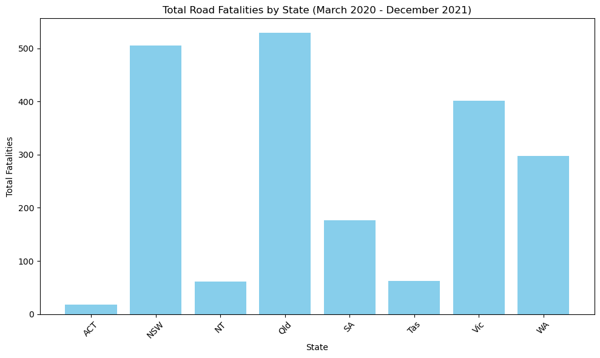

The bar plot shows a single cumulative value for each state, summing up all fatalities over the lockdown period. It is clear that larger states, such as New South Wales (NSW) and Queensland (QLD), recorded the highest total fatalities. In contrast, smaller states like Australian Capital Territory (ACT) and Northern Territory (NT) had significantly fewer overall fatalities.

While this plot offers an easy comparison of total fatalities across states, it doesn't provide insight into the month-to-month variability in fatalities or whether certain states experienced more volatility.

 

<b> Box Plot: Monthly Fatality Distribution per State </b>

To explore how fatalities varied over time, the box plot below highlights the distribution of monthly road fatalities for each state, revealing variability, outliers, and the spread in the data.

 

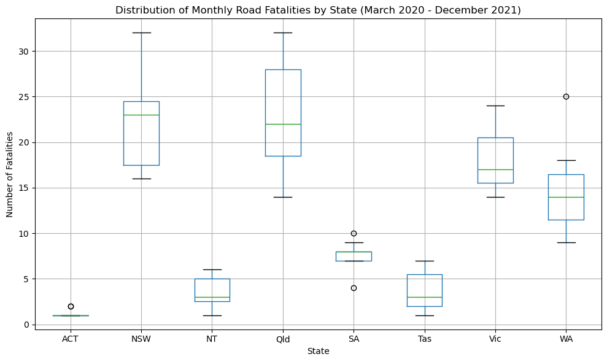

The box plot provides deeper insights into how fatalities fluctuated month-to-month in each state. For example:

NSW had relatively consistent monthly fatalities, with fewer extreme outliers.
Queensland, however, showed more significant variability, with certain months experiencing notably higher fatalities (indicated by a larger interquartile range and outliers).
Smaller states like NT also showed higher fluctuations despite lower overall fatalities, suggesting certain months of heightened road risk.
These differences indicate that road fatalities didn’t remain constant across the lockdown period and varied based on state-specific factors like population behavior, lockdown measures, and regional road safety conditions.

 

<b> ANOVA Test: Comparison of Variance in Fatalities Across States </b>

To statistically test whether the variance in monthly road fatalities differed significantly between states, an ANOVA test was conducted.

- Null Hypothesis (H0): There is no significant difference in the variance of monthly road fatalities between the Australian states.
  - Mathematically, 𝐻0: 𝜎*1{^2}=𝜎_2{^2}=⋯=𝜎*𝑘^{2}, where 𝜎*1^{2},𝜎_2^{2},…,𝜎*𝑘^{2} are the variances in monthly road fatalities for each of the states.
- Alternative Hypothesis (H1): At least one state's variance in monthly road fatalities is significantly different from the others.
  - Mathematically, 𝐻1: 𝜎*𝑖^{2}≠𝜎*𝑗^{2} for at least one pair of states.

 

Since the p-value is much lower than 0.05, we reject the null hypothesis. This means that the variance in monthly road fatalities did, in fact, differ significantly between the Australian states during the COVID-19 lockdown period. The large F-statistic suggests that the variance between groups (states) is much higher than the variance within groups (month-to-month fatalities within each state).

<b>Implications</b>

The ANOVA test provides strong evidence that the variance in monthly road fatalities was not uniform across states. States such as Queensland and NT exhibited more volatility in monthly fatalities, while others, like NSW, had more consistent figures over the lockdown period.

This variance could be attributed to several factors:

- Lockdown measures: Different states implemented varying degrees of travel restrictions and lockdowns, which may have impacted road usage and safety.
- Regional behaviours: States with more rural or open-road driving may have seen spikes in fatalities as restrictions fluctuated or relaxed.
- Population density: Larger states like NSW, despite having a higher total, may have had fewer spikes due to stricter enforcement or more regular traffic patterns.

 

<b> Conclusion</b>

In conclusion, the results of the ANOVA test and visualizations underscore the importance of state-specific road safety measures during periods of restricted movement, such as lockdowns. The significant differences in variance highlight the need for targeted interventions in states that experienced more variability and volatility in road fatalities. Policymakers should investigate further into the factors contributing to these differences to better prepare for future crises and enhance road safety measures during emergency situations.

The bar plot showed the cumulative fatality totals, while the box plot revealed the monthly variability within each state. The ANOVA test statistically confirmed that these variances were significant, providing valuable insights for future safety strategies.

 

<b> Q3: In the past five years, is there a noticeable trend in the number of road fatalities based on various factors such as speed limits, age, time of day, day of the week, and type of road? </b>

 
The analysis of road fatalities over the past five years (2019-2023) reveals significant patterns based on several factors, including speed limits, age, time of day, day of the week, and road type. Below is a breakdown of the trends and conclusions drawn from the graphs:

 

<b>Speed Limits:</b>

 

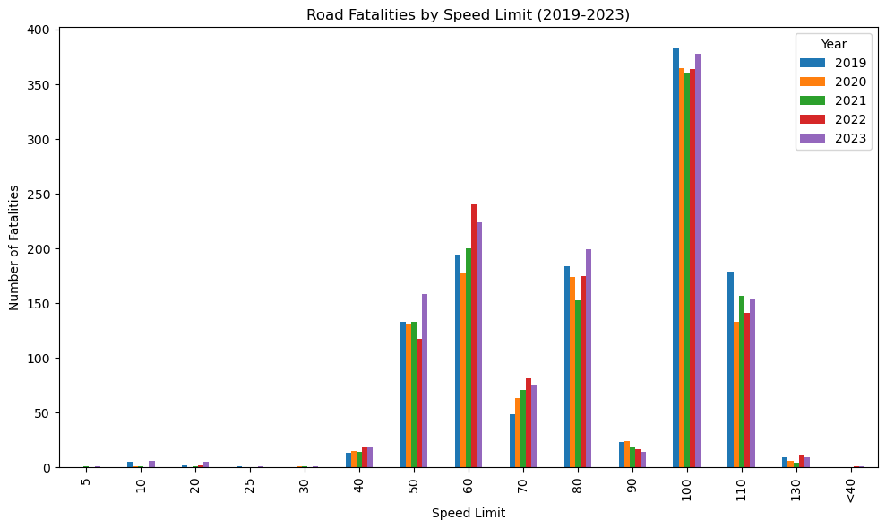

Observations:

- High fatality rates are observed in speed limits ranging from 90 km/h to 100 km/h, which are typically associated with highways and major roads.
- Lower speed limits (below 40 km/h) show significantly fewer fatalities, as expected in areas with more controlled traffic, such as urban and residential areas.
- The fatalities remain relatively consistent across years for the same speed limit, with slight year-on-year variations.

Conclusion:

The analysis highlights that higher speed limits are strongly correlated with higher fatality rates. This emphasises the need for stricter safety regulations on high-speed roads, particularly highways.

 
<b>Age Groups:</b>

 

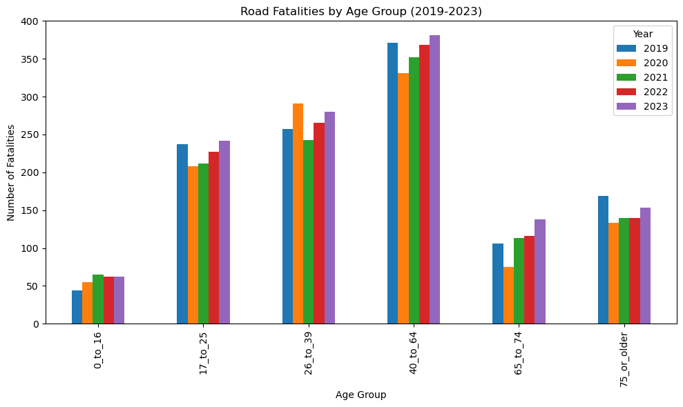

Observations:

- The 40 to 64 age group consistently records the highest fatalities each year, followed by the 26 to 39 age group.
- The 0 to 16 age group and 75 and older group have the fewest fatalities, though the numbers for these groups have been stable across the years.

Conclusion:

Middle-aged drivers (40 to 64 years old) remain the most vulnerable group in terms of road fatalities, possibly due to higher exposure (commuting and longer drives). There could be value in targeted safety campaigns for these age groups.

 
<b>Time of Day:</b>

 

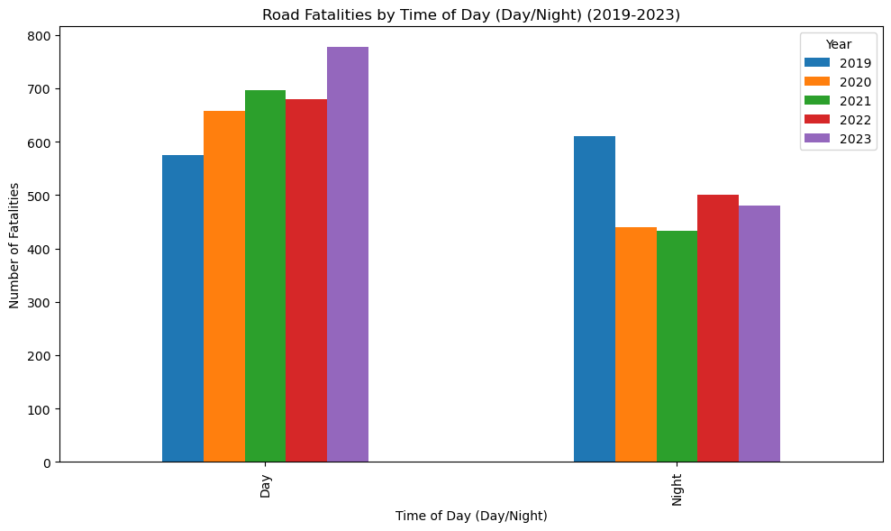

Observations:

- A noticeable trend is that more fatalities occur during the daytime compared to nighttime.
- The gap between day and night fatalities has remained consistent, with daytime accidents consistently surpassing nighttime accidents across all years.

Conclusion:

Despite increased visibility, the day remains a more dangerous time for road fatalities, likely due to higher traffic volumes during the day. This trend highlights the need for continuous safety measures even during daylight hours.

 
<b>Day of the Week:</b>

 

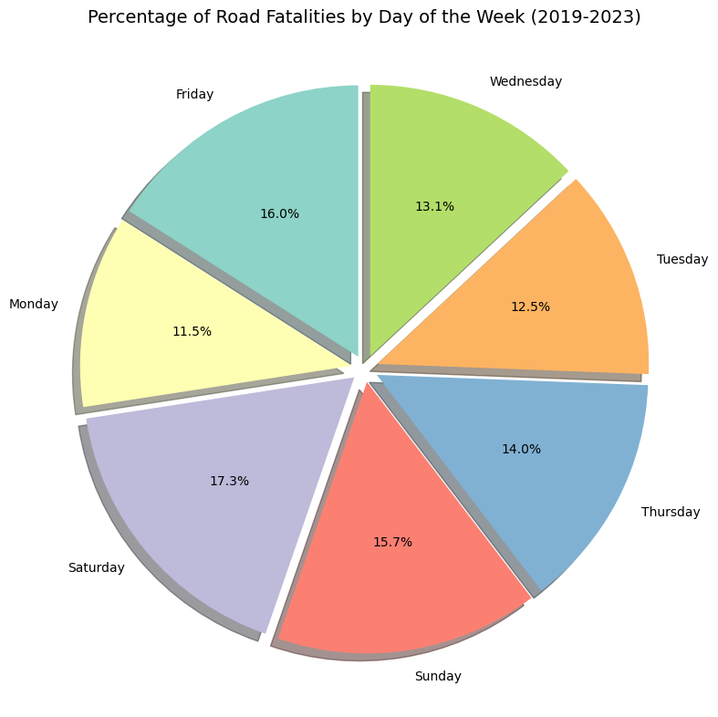

Observations:

- Saturday is the most fatal day of the week, accounting for 17.3% of all fatalities, followed by Sunday at 15.7%.
- Monday records the fewest fatalities, at 11.5%.

Conclusion:

Weekends, particularly Saturday, consistently show the highest fatality rates, likely due to increased recreational travel, social events, and possibly alcohol-related incidents. This suggests a need for enhanced weekend enforcement and awareness campaigns around road safety.

 
<b>Road Type:</b>

 

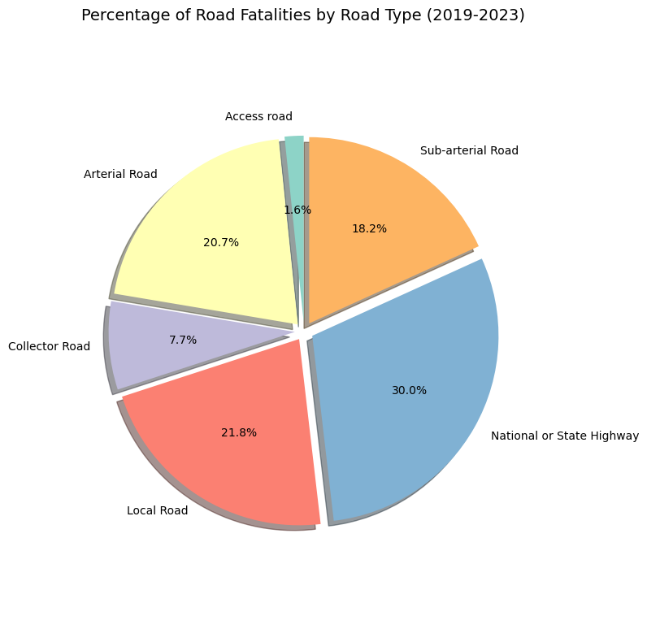

Observations:

- National or State Highways account for the largest share of fatalities, at 30.0%, followed by Local Roads at 21.8%.
- Access roads account for the fewest fatalities, with only 1.6%.

Conclusion:

Highways and local roads continue to see the majority of fatalities, emphasising the need for sustained safety measures on these road types. Improvements in road design, better signage, and stricter speed enforcement could be key areas to target.

 

<b>Q4: In Sydney, did the implementation of road safety measures lead to a significant reduction in road fatalities?</b>

To assess the effectiveness of major road safety interventions in Sydney, we analysed annual road fatality data from 1989 to 2023. Over this 35-year period, several key policy changes were implemented, including the introduction of speed cameras and double demerit points in the late 1990s, followed by random roadside drug testing (RDT) in 2006. The following graph segments the fatality data into three distinct eras based on these interventions, allowing us to observe how road fatalities have changed in response to each policy phase.

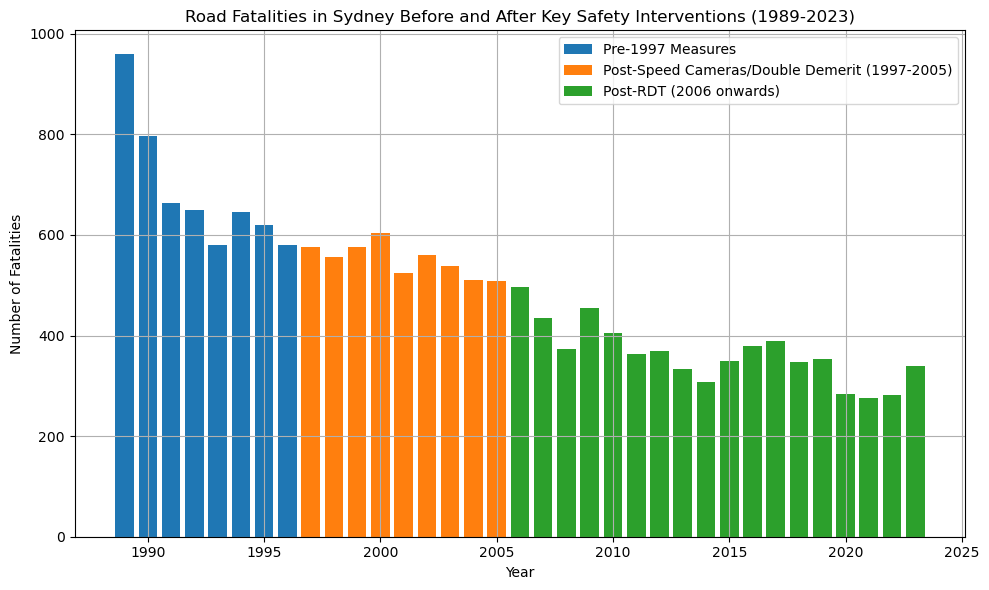

Pre-1997 Period:

From 1989 to 1996, Sydney experienced relatively high fatality numbers, with several years exceeding 600 deaths annually and peaking at over 900 in 1989. This period reflects the state before major interventions like speed cameras or double demerit enforcement. While there was a gradual decline throughout the early 1990s, the overall fatality count remained concerningly high, suggesting that existing policies were insufficient to achieve substantial reductions.

Post-Speed Camera and Double Demerit Period (1997–2005):

The orange bars represent the period following the introduction of speed cameras and double demerit points. During this phase, a clear downward trend is observed. Fatality numbers dropped below 600 and continued declining to near or below 500 in the early 2000s. This suggests a strong initial impact of these enforcement policies, likely due to increased driver caution and improved compliance with speed limits during holiday periods.

Post-Random Drug Testing (2006 Onwards):

From 2006 onwards (green bars), a further and more consistent decline in fatalities can be seen, with numbers stabilizing between approximately 300 and 400 deaths annually, and even dipping below 300 in recent years (e.g., during the COVID period). This indicates that additional enforcement measures, like random drug testing, likely compounded the impact of earlier interventions and contributed to continued improvements in road safety.

Conclusion:

Overall, the chart demonstrates that each phase of safety intervention, particularly the introduction of speed enforcement and drug testing, coincided with a meaningful reduction in road fatalities. While other external factors (like advancements in vehicle safety or temporary COVID-related traffic reductions) may have influenced the recent lows, the long-term trend strongly supports the conclusion that Sydney’s road safety measures have been effective in significantly reducing road fatalities over the last three decades.
 

<b> Q5: Which factors most strongly explain fatal crash counts in Australia? </b>

Scope: Monthly state-level fatal crash counts, 1989–2023 (2024 excluded).

Method (summary):

- Aggregated counts by State × Year × Month.
- Fitted a generalized linear model on monthly counts with State fixed effects, Month seasonality, a linear Year trend, and holiday indicators (Christmas/Easter). Used Poisson regression with a check for overdispersion; if present, refit with Negative Binomial.
- Reported Incidence Rate Ratios (IRRs) with 95% CIs to quantify associations.

Key insights (interpretation template; see notebook for exact IRRs):

- Strong seasonal month effects and material differences across states.
- A significant negative Year trend indicates continued long-run reduction after controlling for seasonality and state.
- Holiday indicators highlight whether Christmas/Easter months are associated with elevated counts.

See the notebook Q5 section for the full model summary and top IRRs table.

Visuals:

- IRR by month with 95% CIs: 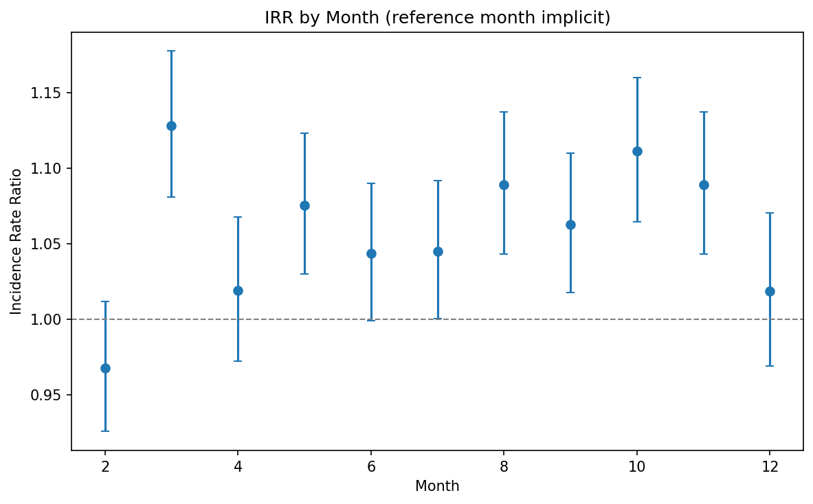
- Top terms by absolute IRR deviation from 1: 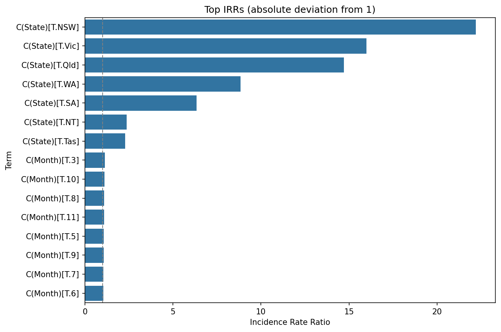
- NSW actual vs predicted monthly counts: 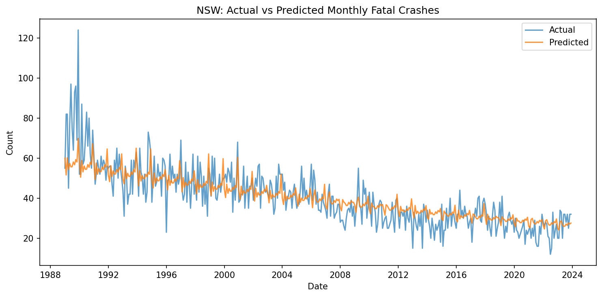

Modeling notes (for robustness and interpretability):

- Center the year (e.g., YearC = Year − 2000) so the intercept and year IRR are easier to interpret.
- Include an exposure offset for different month lengths (offset = log(days in month)) so months are comparable.
- If population by state-year is available, add an additional offset log(population) to approximate per-capita rates.

Findings

- State and month effects are strong drivers of monthly fatal crash counts, consistent with seasonal and regional patterns.
- The year trend remains negative and significant after controlling for state and seasonality, aligning with the long‑run decline seen in Q1.
- Holiday exposure (Christmas/Easter) shows small positive associations, suggesting modest increases during those periods.
- Face‑validity: Predicted vs actual for NSW tracks the broad pattern, with some deviations at local spikes.

Limitations

- Counts, not per‑capita: without population offsets, comparisons may conflate exposure with risk. If available, add log(population) as an offset.
- Month‑length exposure: add log(days in month) offset to normalize exposure by month length.
- Omitted variables: speed mix, road type mix, traffic volume (VKT), enforcement intensity, weather—adding these could refine estimates.
- Model form: Poisson/Negative Binomial assumes log‑linear effects; interactions (e.g., State×Month, Speed×RoadType) could uncover additional structure.
- Data quality: missing categories and “Unknown” values may bias certain effects; sensitivity checks recommended.

## References

Data for this project was sourced from the Australian Bureau of Infrastructure and Transport Research Economics (BITRE) Fatal Road Crash Database, available at: https://www.bitre.gov.au/statistics/safety/fatal_road_crash_database.

## License

This project is licensed under the [MIT License](https://github.com/Yukitoshi12345/Australia-Road-Fatality/blob/main/LICENSE).
